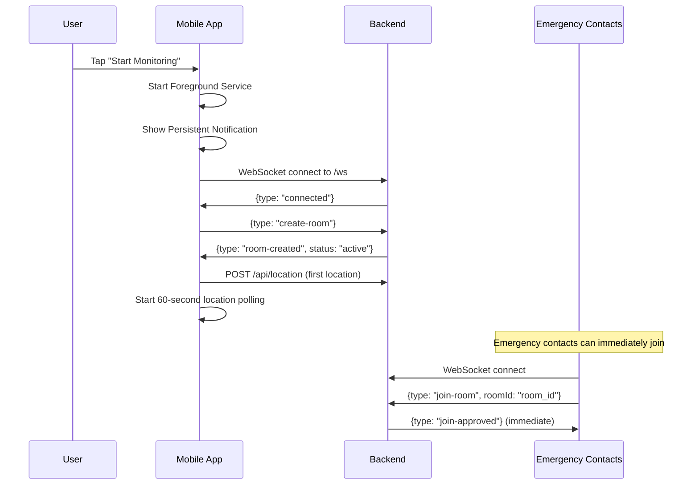
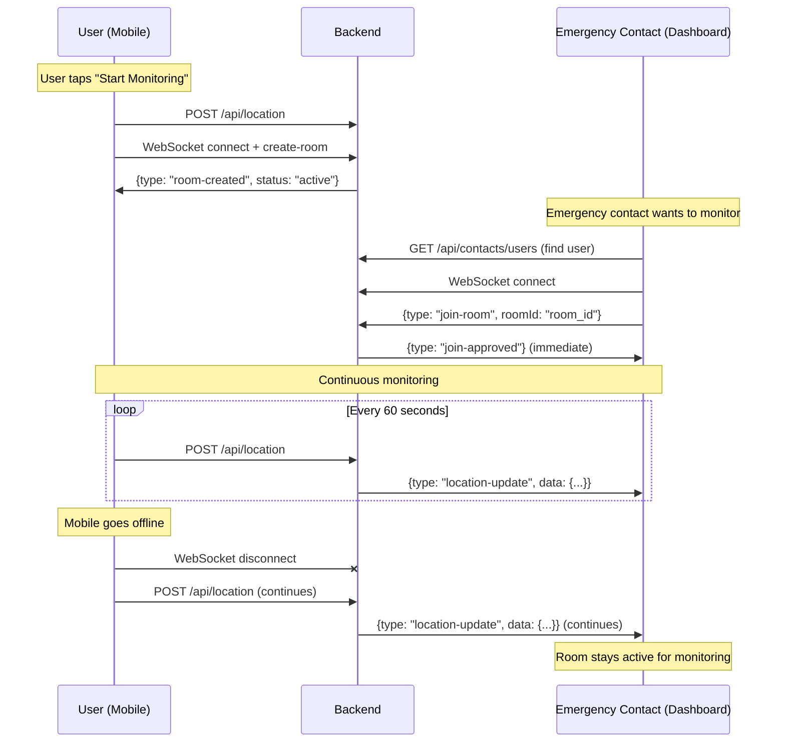
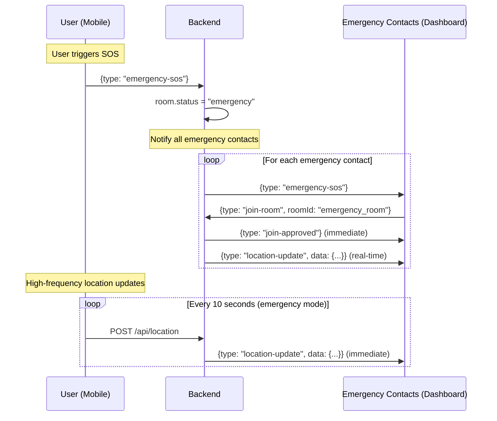

# Lifeline Emergency Monitoring System - Simplified Architecture Overview

**Project**: Lifeline Emergency Monitoring & Location Tracking  
**Scope**: Mobile-to-Web integration with persistent room management  
**Audience**: College capstone students, developers, technical stakeholders  

---

## 🎯 CORE ARCHITECTURE

### **Technology Stack**
- **Backend Framework**: HonoJS with Bun runtime
- **WebSocket Implementation**: Bun WebSocket helper
- **Database**: PostgreSQL with connection pooling
- **Authentication**: BetterAuth framework for session management
- **Deployment**: Bun runtime for optimal performance

### **Simple Principle: Active/Inactive Rooms**
**YES** - Even when the mobile user disconnects from WebSocket, the room stays active for emergency contacts to continue monitoring through location REST uploads.

---

## 📱 MOBILE APPLICATION

### **1. Simple Monitoring Flow**

#### **1.1 User Starts Monitoring**


#### **1.2 Background Location Tracking**
```javascript
// Mobile App - Continuous Location Upload
class LocationTracker {
    constructor() {
        this.trackingActive = false;
        this.websocket = null;
        this.locationQueue = [];
    }
    
    async startMonitoring() {
        // Start foreground service for Android background execution
        await this.startForegroundService('Lifeline Monitoring Active');
        
        // Establish WebSocket connection using Bun WebSocket helper
        this.websocket = new WebSocket('ws://api.lifeline.com/api/ws');
        await this.setupWebSocketHandlers();
        
        // Create monitoring room with emergency contacts pre-loaded
        this.websocket.send(JSON.stringify({ 
            type: 'create-room',
            emergencyContacts: this.getEmergencyContacts()
        }));
        
        // Start continuous location tracking
        this.startLocationPolling();
        this.trackingActive = true;
    }
    
    startLocationPolling() {
        setInterval(async () => {
            try {
                const location = await this.getCurrentLocation();
                await this.uploadLocation(location);
                
                // Try to maintain WebSocket connection
                if (this.websocket?.readyState === WebSocket.OPEN) {
                    this.websocket.send(JSON.stringify({ type: 'ping' }));
                }
            } catch (error) {
                console.error('Location tracking error:', error);
                // Queue location for retry
                this.locationQueue.push(location);
            }
        }, 60000); // Every 60 seconds
    }
    
    async uploadLocation(location) {
        // REST upload - works even with WebSocket disconnected
        const response = await fetch('/api/location', {
            method: 'POST',
            headers: {
                'Authorization': `Bearer ${await this.getAuthToken()}`,
                'Content-Type': 'application/json'
            },
            body: JSON.stringify({
                latitude: location.latitude,
                longitude: location.longitude,
                timestamp: location.timestamp,
                accuracy: location.accuracy
            })
        });
        
        if (!response.ok) {
            throw new Error(`Location upload failed: ${response.status}`);
        }
        
        return response.json();
    }
    
    async handleWebSocketDisconnect() {
        // WebSocket disconnected, but tracking continues
        this.websocket = null;
        
        // Exponential backoff for reconnection
        const retryDelay = Math.min(1000 * Math.pow(2, this.reconnectAttempts), 30000);
        
        setTimeout(() => {
            this.reconnectAttempts++;
            this.startMonitoring(); // Attempt to reconnect
        }, retryDelay);
        
        // IMPORTANT: Location tracking continues regardless of WebSocket status
        console.log('WebSocket disconnected, location tracking continues via REST');
    }
}
```

---

## 🌐 BACKEND SERVER

### **2. Simple Room Management**

#### **2.1 Room State Management**
```typescript
// Backend - HonoJS Room Manager with PostgreSQL
import { Hono } from 'hono';
import { getDatabase } from '../db/database';

class RoomManager {
    private rooms = new Map<string, Room>();
    private userRooms = new Map<string, string>(); // userId -> roomId
    private db = getDatabase();
    
    // Simple room creation with pre-loaded emergency contacts
    async createRoom(userId: string, emergencyContacts: string[]): Promise<string> {
        const roomId = this.generateRoomId();
        const room: Room = {
            id: roomId,
            ownerId: userId,
            status: 'active',
            emergencyContacts: emergencyContacts,
            users: new Set([userId]), // Owner is auto-added
            createdAt: new Date(),
            lastLocationUpdate: new Date()
        };
        
        this.rooms.set(roomId, room);
        this.userRooms.set(userId, roomId);
        
        return roomId;
    }
    
    // Emergency contacts can join immediately
    handleJoinRequest(roomId: string, userId: string): boolean {
        const room = this.rooms.get(roomId);
        if (!room) return false;
        
        // Check if user is in emergency contacts list
        if (room.emergencyContacts.includes(userId)) {
            room.users.add(userId);
            return true; // Immediate approval
        }
        
        return false; // Not authorized
    }
    
    // Room stays active when owner disconnects
    handleUserDisconnect(userId: string) {
        const roomId = this.userRooms.get(userId);
        const room = this.rooms.get(roomId);
        
        if (!room) return;
        
        // Remove user's WebSocket from room
        room.users.delete(userId);
        
        // **KEY: Room remains active for monitoring**
        // Only destroy room if:
        // 1. Room has no active users for 30 minutes
        // 2. Room has expired (24-hour timeout)
        
        if (room.users.size === 0) {
            // Set expiration timeout, don't destroy immediately
            room.expiresAt = new Date(Date.now() + 30 * 60 * 1000); // 30 minutes
        }
    }
    
    // Location uploads keep room "alive"
    handleLocationUpdate(userId: string, location: LocationData) {
        const roomId = this.userRooms.get(userId);
        const room = this.rooms.get(roomId);
        
        if (!room) return;
        
        // Reset room expiration on location activity
        if (room.expiresAt) {
            room.expiresAt = null;
        }
        room.lastLocationUpdate = new Date();
        
        // Broadcast location to room members
        this.broadcastToRoom(roomId, {
            type: 'location-update',
            data: {
                userId: userId,
                userName: location.userName,
                latitude: location.latitude,
                longitude: location.longitude,
                timestamp: location.timestamp,
                accuracy: location.accuracy
            },
            timestamp: new Date().toISOString()
        }, userId); // Don't send to self
    }
    
    // Simple SOS trigger
    triggerEmergency(roomId: string, userId: string) {
        const room = this.rooms.get(roomId);
        if (!room) return;
        
        room.status = 'emergency';
        room.expiresAt = null; // Emergency rooms don't expire
        
        // Broadcast emergency activation
        this.broadcastToRoom(roomId, {
            type: 'emergency-sos',
            triggeredBy: userId,
            message: 'SOS activated - emergency contacts alerted',
            timestamp: new Date().toISOString()
        });
    }
}
```

#### **2.2 Location Ingestion & Room Bridging**
```typescript
// Backend - HonoJS Location Endpoint with BetterAuth
import { auth } from '../lib/auth';

const locationRoutes = new Hono<{ Variables: { user: any } }>();

locationRoutes.use('*', async (c, next) => {
    const session = await auth.api.getSession({
        headers: c.req.header()
    });
    if (!session) {
        return c.json({ error: 'Unauthorized' }, 401);
    }
    c.set('user', session.user);
    await next();
});

locationRoutes.post('/api/location', async (c) => {
    const user = c.get('user'); // From BetterAuth middleware
    const { latitude, longitude, timestamp, accuracy } = req.body;
    
    // Validate input
    if (!latitude || !longitude || !timestamp) {
        return res.status(400).json({ error: 'Missing required fields' });
    }
    
    const locationData = {
        userId: user.id,
        userName: user.name,
        latitude,
        longitude,
        timestamp: new Date(timestamp),
        accuracy: accuracy || null,
        receivedAt: new Date()
    };
    
        // Find or create user's monitoring room
        let roomId = roomManager.getUserRoom(user.id);
        if (!roomId) {
            // Auto-create room if user uploads location without WebSocket
            const emergencyContacts = await getEmergencyContacts(user.id);
            roomId = await roomManager.createRoom(user.id, emergencyContacts);
        }
    
    // Bridge REST location to WebSocket room
    roomManager.handleLocationUpdate(user.id, locationData);
    
    return res.json({
        success: true,
        received: locationData.receivedAt,
        roomId: roomId,
        status: roomManager.getRoom(roomId)?.status
    });
});
```

---

## 🖥️ FRONTEND DASHBOARD (Emergency Contact Interface)

### **3. Simple Emergency Monitoring**

#### **3.1 Emergency Contact Joins Monitoring**
```javascript
// Frontend Dashboard - Simple Emergency Monitoring
class EmergencyDashboard {
    constructor() {
        this.websocket = null;
        this.activeMonitoring = false;
        this.currentUser = null;
        this.monitoredUser = null;
    }
    
    async startMonitoring(userPhoneOrEmail) {
        try {
            // Find the user to monitor via HonoJS API
            const userResponse = await fetch(`/api/contacts/users?phone=${userPhoneOrEmail}`, {
                headers: {
                    'Authorization': `Bearer ${await getAuthToken()}`
                }
            });
            const userData = await userResponse.json();
            
            if (!userData.user) {
                throw new Error('User not found');
            }
            
            this.monitoredUser = userData.user;
            
            // Connect to WebSocket using Bun WebSocket helper
            this.websocket = new WebSocket('ws://api.lifeline.com/api/ws');
            await this.setupWebSocketHandlers();
            
            // Join monitoring room immediately (no approval needed)
            this.websocket.send(JSON.stringify({
                type: 'join-room',
                roomId: userData.activeRoomId
            }));
            
        } catch (error) {
            this.showError(`Failed to start monitoring: ${error.message}`);
        }
    }
    
    async setupWebSocketHandlers() {
        return new Promise((resolve) => {
            this.websocket.onopen = () => {
                console.log('Connected to monitoring system');
                resolve();
            };
            
            this.websocket.onmessage = (event) => {
                const data = JSON.parse(event.data);
                this.handleWebSocketMessage(data);
            };
            
            this.websocket.onerror = (error) => {
                console.error('WebSocket error:', error);
                this.handleReconnection();
            };
        });
    }
    
    handleWebSocketMessage(data) {
        switch (data.type) {
            case 'join-approved':
                this.activeMonitoring = true;
                this.showMonitoringInterface();
                this.showNotification('Monitoring started successfully');
                break;
                
            case 'join-denied':
                this.showAccessDenied(data.reason);
                break;
                
            case 'location-update':
                this.updateUserLocation(data.data);
                this.updateLastSeenTime(data.data.timestamp);
                break;
                
            case 'emergency-sos':
                this.handleEmergencyAlert(data);
                break;
                
            case 'user-left':
                if (data.userId === this.monitoredUser?.id) {
                    this.showUserOfflineStatus();
                }
                break;
        }
    }
    
    updateUserLocation(locationData) {
        const { latitude, longitude, timestamp, accuracy } = locationData;
        
        // Update map
        this.map.setView([latitude, longitude], 16);
        this.marker.setLatLng([latitude, longitude]);
        
        // Update location info
        document.getElementById('coordinates').textContent = 
            `${latitude.toFixed(6)}, ${longitude.toFixed(6)}`;
        document.getElementById('last-update').textContent = 
            new Date(timestamp).toLocaleString();
        document.getElementById('accuracy').textContent = 
            accuracy ? `${accuracy}m` : 'Unknown';
        
        // Show user is online/moving
        this.showUserStatus('active');
    }
    
    handleEmergencyAlert(alertData) {
        // Show prominent emergency notification
        this.showEmergencyBanner({
            message: alertData.message,
            userName: alertData.emergencyUserName,
            time: alertData.timestamp,
            roomId: alertData.roomId
        });
    }
}
```

#### **3.2 Simple Dashboard UI**
```html
<!-- Dashboard HTML Structure -->
<div class="emergency-dashboard">
    <!-- User Search & Monitoring Controls -->
    <div class="monitoring-controls">
        <input type="text" id="user-search" placeholder="Enter phone or email">
        <button onclick="startMonitoring()">Start Monitoring</button>
        <div id="monitoring-status" class="status-indicator"></div>
    </div>
    
    <!-- Emergency Alert Banner -->
    <div id="emergency-banner" class="emergency-banner hidden">
        <div class="alert-content">
            <h2>🚨 EMERGENCY ALERT</h2>
            <p id="emergency-message"></p>
            <button onclick="handleEmergencyAction()">Take Action</button>
        </div>
    </div>
    
    <!-- Location Map -->
    <div class="location-section">
        <div id="map"></div>
        <div class="location-info">
            <h3>Location Information</h3>
            <div class="info-grid">
                <div class="info-item">
                    <label>Coordinates:</label>
                    <span id="coordinates">--</span>
                </div>
                <div class="info-item">
                    <label>Last Update:</label>
                    <span id="last-update">--</span>
                </div>
                <div class="info-item">
                    <label>Accuracy:</label>
                    <span id="accuracy">--</span>
                </div>
                <div class="info-item">
                    <label>Status:</label>
                    <span id="user-status" class="status-badge">offline</span>
                </div>
            </div>
        </div>
    </div>
</div>
```

---

## 🔗 SIMPLE INTEGRATION FLOW

### **4. Core Monitoring Flow**

#### **4.1 User Starts Monitoring → Emergency Contacts Join**


#### **4.2 Emergency SOS Flow**


---

## 🔧 TECHNICAL IMPLEMENTATION DETAILS

### **5. HonoJS + PostgreSQL Implementation**

#### **5.1 Database Schema**
```sql
-- PostgreSQL tables for persistent room management
CREATE TABLE rooms (
    id VARCHAR(32) PRIMARY KEY,
    owner_id VARCHAR(255) NOT NULL,
    emergency_contacts TEXT[] NOT NULL,
    is_active BOOLEAN DEFAULT true,
    status VARCHAR(20) DEFAULT 'active',
    created_at TIMESTAMP DEFAULT NOW(),
    last_location_update TIMESTAMP,
    expires_at TIMESTAMP
);

CREATE TABLE room_members (
    room_id VARCHAR(32) REFERENCES rooms(id) ON DELETE CASCADE,
    user_id VARCHAR(255) NOT NULL,
    joined_at TIMESTAMP DEFAULT NOW(),
    PRIMARY KEY (room_id, user_id)
);

CREATE TABLE location_updates (
    id SERIAL PRIMARY KEY,
    user_id VARCHAR(255) NOT NULL,
    room_id VARCHAR(32) REFERENCES rooms(id),
    latitude DECIMAL(10, 8) NOT NULL,
    longitude DECIMAL(11, 8) NOT NULL,
    timestamp TIMESTAMP NOT NULL,
    accuracy INTEGER,
    created_at TIMESTAMP DEFAULT NOW()
);
```

#### **5.2 BetterAuth Integration**
```typescript
// BetterAuth configuration for HonoJS
import { betterAuth } from "better-auth";
import { postgresAdapter } from "better-auth/adapters/postgres";

export const auth = betterAuth({
  database: postgresAdapter({
    url: process.env.DATABASE_URL!,
  }),
  session: {
    expiresIn: 60 * 60 * 24 * 7, // 7 days
    updateAge: 60 * 60 * 24, // 1 day
  },
  socialProviders: {
    // Configure social providers as needed
  },
});
```

### **5. Simple Room Persistence Rules**

#### **5.1 When Rooms Stay Active**
```typescript
// Room stays active in these scenarios:
1. User uploads location via REST (even without WebSocket)
2. Room is in "emergency" status
3. Room has active emergency contacts monitoring

// Room only expires when:
1. No location updates for 30 minutes AND no active monitors
2. 24-hour hard timeout reached
```

#### **5.2 Location Data Flow**
```typescript
// Complete data flow: Mobile → Backend → Dashboard
Mobile: {
    GPS → Location Service → REST POST /api/location
}

Backend: {
    REST Endpoint → Validate Auth → Room Manager → WebSocket Broadcast
}

Dashboard: {
    WebSocket Listener → Update UI → Show Real-time Location
}

// Even if WebSocket disconnects:
Mobile REST → Backend Storage → Dashboard WebSocket Reconnect → Full Sync
```

### **5.3 Mobile Background Optimization**
```typescript
// Android-specific considerations for background tracking
class AndroidLocationOptimizer {
    optimizeForBackground() {
        // Use WorkManager for reliability
        const locationWork = new OneTimeWorkRequest.Builder(LocationWorker.class)
            .setConstraints(new Constraints.Builder()
                .setRequiredNetworkType(NetworkType.CONNECTED)
                .build())
            .setBackoffCriteria(
                BackoffPolicy.EXPONENTIAL,
                OneTimeWorkRequest.MIN_BACKOFF_MILLIS,
                OneTimeWorkRequest.MAX_BACKOFF_MILLIS
            )
            .build();
        
        WorkManager.getInstance(context).enqueue(locationWork);
        
        // Show persistent notification
        this.showPersistentNotification('Lifeline', 'Monitoring active', true);
        
        // Optimize battery usage
        this.setLocationUpdateProvider(PowerManager.LOCATION_MODE_POWER_SAVE);
    }
}
```

---

## 📊 SIMPLE MONITORING FEATURES

### **6. Dashboard Capabilities**

#### **6.1 Real-time Location Display**
- **Live Map**: Interactive map with user position
- **Location History**: Trail of recent movements
- **Accuracy Indicators**: GPS precision display
- **Last Seen Timestamp**: Real-time update status

#### **6.2 Emergency Alerts**
- **SOS Notifications**: Immediate emergency alerts
- **Panic Button**: User-initiated emergency
- **Emergency Contact Auto-Join**: Automatic monitoring access

---

## 🚀 DEPLOYMENT CONSIDERATIONS

### **7. Scalability & Performance**

#### **7.1 WebSocket Scaling**
```typescript
// Handle thousands of simultaneous monitoring sessions with Bun
const server = Bun.serve({
    port: 3000,
    fetch: app.fetch,
    websocket: {
        open: handleWebSocketOpen,
        message: handleWebSocketMessage,
        close: handleWebSocketClose,
        error: handleWebSocketError,
    },
});

// Use PostgreSQL for room state across instances
const roomData = await db.query(
    'SELECT * FROM rooms WHERE id = $1',
    [roomId]
);
```

#### **7.2 Location Data Processing**
```typescript
// High-volume location ingestion with Bun queue
import { Queue } from 'bun-queue';

const locationQueue = new Queue('location-updates', {
    concurrency: 10,
    maxRetries: 3,
});

locationQueue.process(async (job) => {
    const { userId, location } = job.data;
    
    // Process location update with PostgreSQL
    await processLocationUpdate(userId, location);
    
    // Broadcast to WebSocket rooms via Bun helper
    await broadcastLocationToRooms(userId, location);
});

// Rate limiting to prevent abuse with HonoJS middleware
import { rateLimiter } from 'hono/rate-limiter';

const app = new Hono();

app.use('*', rateLimiter({
    windowMs: 60 * 1000, // 1 minute
    max: 30, // max 30 location updates per minute per user
    message: 'Too many location updates',
}));
```

---

## 🔒 SECURITY & PRIVACY

### **8. Privacy Protection Features**

#### **8.1 Access Control**
- **Emergency Contact Validation**: Only verified emergency contacts can monitor
- **Room Security**: Emergency contacts pre-loaded during room creation
- **Emergency Override**: Automatic access during SOS situations
- **Data Encryption**: All location data encrypted in transit and at rest

#### **8.2 Data Retention**
- **Temporary Rooms**: Auto-destruction after inactivity
- **Location History**: Configurable retention periods
- **Emergency Logs**: Immutable audit trail for emergencies
- **User Consent**: Explicit opt-in for monitoring features

---

## 📱 MOBILE APP SPECIFICATIONS

### **9. Required Permissions & Features**

#### **9.1 Android Requirements**
```xml
<!-- Required permissions -->
<uses-permission android:name="android.permission.ACCESS_FINE_LOCATION" />
<uses-permission android:name="android.permission.ACCESS_COARSE_LOCATION" />
<uses-permission android:name="android.permission.FOREGROUND_SERVICE" />
<uses-permission android:name="android.permission.WAKE_LOCK" />
<uses-permission android:name="android.permission.INTERNET" />

<!-- Foreground service declaration -->
<service
    android:name=".LocationService"
    android:foregroundServiceType="location"
    android:enabled="true"
    android:exported="false" />
```

#### **9.2 iOS Requirements**
```swift
// iOS location capabilities
import CoreLocation
import BackgroundTasks

class LocationManager: NSObject, CLLocationManagerDelegate {
    private let locationManager = CLLocationManager()
    
    func requestPermissions() {
        locationManager.requestAlwaysAuthorization()
        locationManager.allowsBackgroundLocationUpdates = true
        locationManager.pausesLocationUpdatesAutomatically = false
    }
    
    func startBackgroundTracking() {
        let locationManager = CLLocationManager()
        locationManager.desiredAccuracy = kCLLocationAccuracyBest
        locationManager.distanceFilter = 10 // meters
        locationManager.startUpdatingLocation()
        
        // Background task registration
        BGTaskScheduler.shared.register(forTaskWithIdentifier: 
            "com.lifeline.location-tracking", 
            using: nil) { task in
            // Handle background task
        }
    }
}
```

---

## ✅ SUCCESS METRICS

### **10. Performance Benchmarks**

#### **10.1 Response Times**
- **Emergency SOS Response**: < 500ms
- **Location Upload Processing**: < 200ms
- **WebSocket Message Delivery**: < 50ms
- **Dashboard Update**: < 100ms
- **Room Creation**: < 100ms

#### **10.2 Reliability Targets**
- **Location Upload Success Rate**: > 99.5%
- **WebSocket Reconnection Time**: < 5 seconds
- **Emergency Alert Delivery**: > 99.9%
- **System Uptime**: > 99.95%

---

## 🎯 CONCLUSION

This simplified architecture ensures that **rooms stay active for emergency monitoring** even when mobile users disconnect from WebSocket. The system provides:

✅ **Simple Core Flow**: Start Monitoring → Emergency Contacts Can Immediately Join  
✅ **Persistent Monitoring**: Location uploads continue via REST regardless of WebSocket status  
✅ **Emergency Priority**: SOS triggers immediate access for all emergency contacts  
✅ **Privacy Protection**: Only pre-validated emergency contacts can monitor  
✅ **Mobile Optimization**: Battery-efficient background tracking compatible with Android/iOS  
✅ **Real-time Updates**: Emergency contacts receive live location via WebSocket broadcasting  
✅ **Scalable Design**: Handles thousands of simultaneous monitoring sessions  

The system successfully balances **simplicity for capstone students** with **life-critical emergency functionality**, creating a robust emergency monitoring platform that's easy to understand and implement using **HonoJS + Bun + PostgreSQL + BetterAuth** for optimal performance and developer experience.